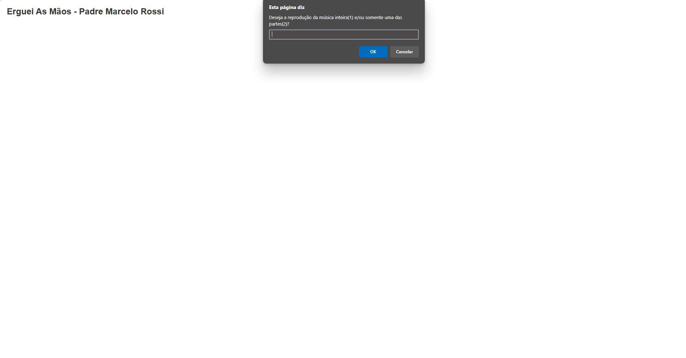

# Acelera ZG (JavaScript)



## Descrição

Esta aplicação foi desenvolvida como parte de um desafio para uma vaga na Acelera ZG. O objetivo é reproduzir a música "Erguei As Mãos" do Padre Marcelo Rossi, utilizando JavaScript para evitar a repetição de trechos da música. A aplicação permite escolher entre reproduzir a música inteira ou apenas partes específicas, exibindo as letras dinamicamente na tela.

## Iniciando o projeto

```bash
# Clonar aplicação
$ git clone https://github.com/sillasemanoel/acelera-zg.git

# Acessar a aplicação
$ cd acelera-zg

# Abrir o index.html no navegador

```

## Ferramentas

- HTML
- CSS
- JavaScript

## Aprendizados importantes

- Manipulação do DOM
- Funções e escopos
- Estruturas de controle
- Eventos e interatividade

## Funcionalidades

- Reprodução de música;
- Escolha de reprodução completa ou parcial;
- Exibição de mensagens dinâmicas;
- Contadores de interações;
- Estilização básica com CSS;