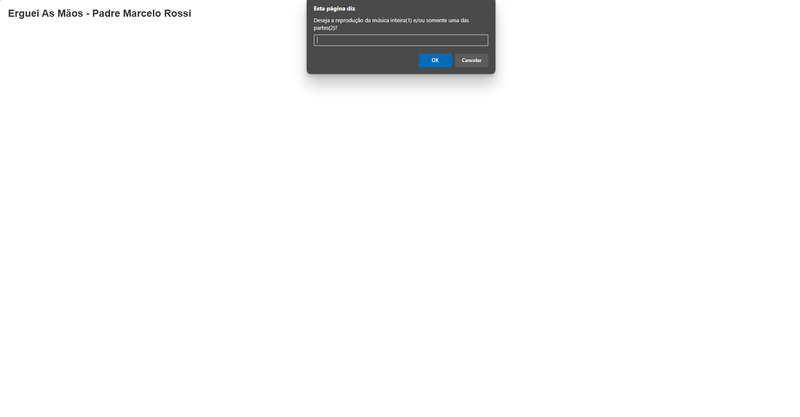

<h1 align="center">
    
</h1>
<p align="center">Aplicativo criado como parte de um teste prático para a vaga na Acelera ZG, focado na resolução de problemas e aplicação de conhecimentos em JavaScript.</p>
<p align="center">
 <a href="#sobre-o-projeto">Sobre o Projeto</a> |
 <a href="#tecnologias">Tecnologias</a> |
 <a href="#como-comecar">Como Começar</a> |
 <a href="#licenca">Licença</a> |
 <a href="#autor">Autor</a> 
</p>

### Sobre o Projeto

Este projeto foi desenvolvido como parte de um teste prático para a vaga na Acelera ZG. O objetivo era criar uma função que gerasse uma música inteira ou uma parte dela sem ter que escrevê-la manualmente.

---

### Tecnologias

- [HTML5](https://developer.mozilla.org/en-US/docs/Web/Guide/HTML/HTML5) - Linguagem de marcação utilizada para estruturar a página.
- [CSS3](https://developer.mozilla.org/en-US/docs/Web/CSS) - Folhas de estilo em cascata utilizadas para estilizar a página.
- [JavaScript](https://developer.mozilla.org/en-US/docs/Web/JavaScript) - Linguagem de programação utilizada para implementar a lógica das funcionalidades.

---

### Como Começar

```bash
# Clone o repositório
$ git clone https://github.com/sillasemanoel/acelera-zg

# Navegue até o diretório do projeto
$ cd acelera-zg

# Abra o arquivo index.html no seu navegador
$ index.html
```

---

### Licença

Distribuído sob a Licença MIT. Veja [LICENSE](LICENSE) para mais informações.

---

### Autor

Feito por Sillas Emanoel 👋🏽
